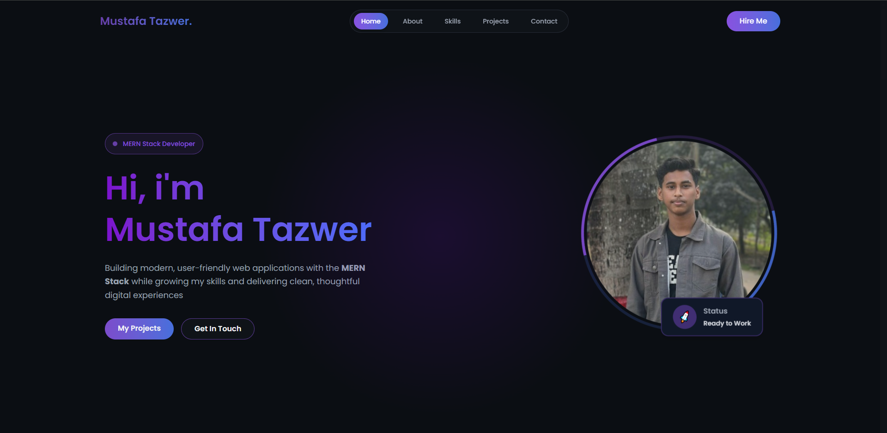
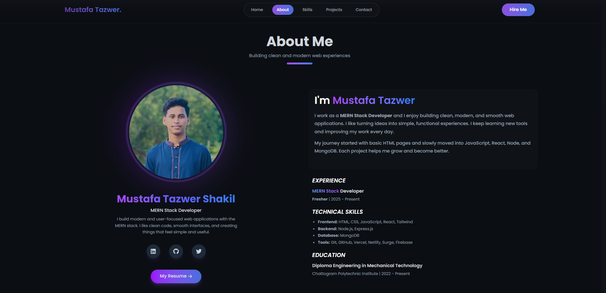
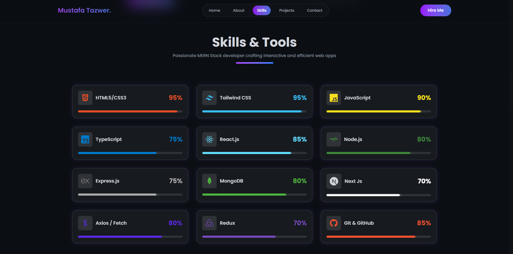
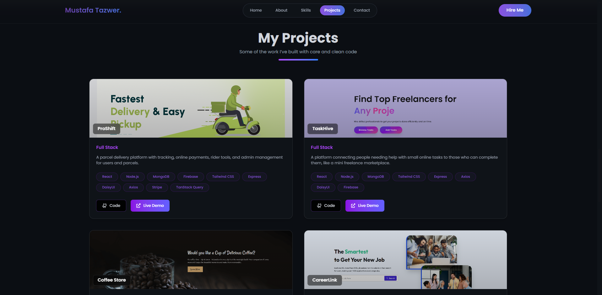
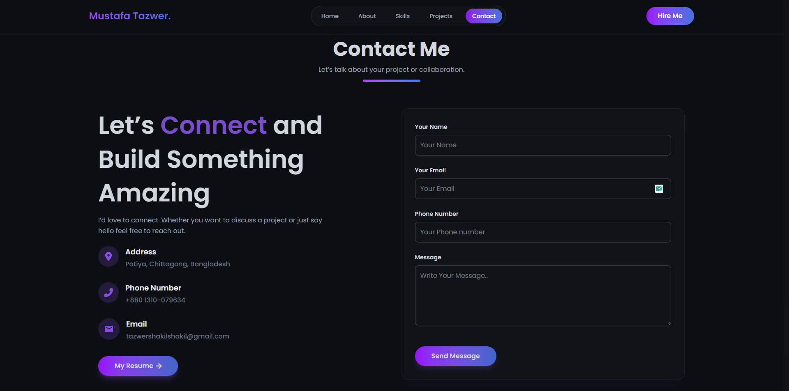
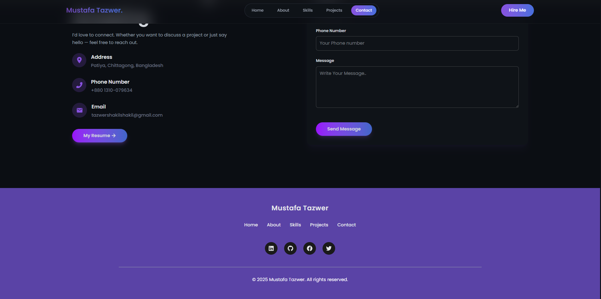
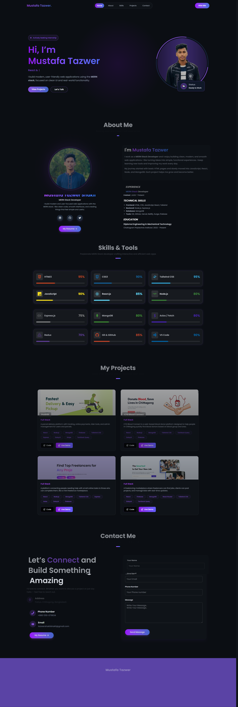

# 🚀 Mustafa Tazwer - Portfolio Website

A modern, responsive portfolio website built with **React**, showcasing my skills, projects, and experience as a **MERN Stack Developer**.

[Live Portfolio](https://mustafa-tazwer.vercel.app/)


## ✨ Features
🎨 **Modern UI/UX** – Clean, professional design with smooth animations  
📱 **Fully Responsive** – Works seamlessly on all devices  
🎭 **Smooth Animations** – Powered by Framer Motion  
🎠 **Project Cards** – Interactive and animated project sections  
📧 **Contact Form** – Functional form integrated with EmailJS  
🌙 **Dark Mode** – Eye-friendly dark Navy theme  
⚡ **Fast Performance** – Optimized with Vite  
🎯 **Smooth Scrolling** – Seamless navigation between sections  

---

## 🛠️ Built With
- **Frontend Framework:** React 18  
- **Build Tool:** Vite  
- **Styling:** Tailwind CSS, DaisyUI  
- **Animations:** Framer Motion  
- **Icons:** React Icons  
- **Form Handling:** EmailJS  
- **Smooth Scrolling:** React Scroll  

---

## 🚀 Getting Started
### Prerequisites
- Node.js (v18 or higher)  
- npm or yarn

### Installation
```bash
git clone https://github.com/sahkil12/My-Portfolio.git
```

```bash
cd My-Portfolio
```

```bash
npm install
```

```bash
npm run dev
```
Open your browser and visit http://localhost:5173

## Build for Production

```bash
npm run build
```
The build files will be generated in the dist folder.

### 🌐 Deployment

This project is configured for easy deployment on Vercel.

**Deploy to Vercel:**
Live link:-[(https://mustafa-tazwer.vercel.app/)]


### 👤 Author
Mustafa Tazwer

-**GitHub**: [(https://github.com/sahkil12)]

-**LinkedIn**: [(https://www.linkedin.com/in/md-mustafa32/)]

-**Twitter**: [(https://x.com/MustafaTaz11432)]

-**Email**: tazwershakilshakil@gmail.com

## 📸 Portfolio Screenshot









**⭐ If you like this project, please give it a star!**

Made with ❤️ by Mustafa Tazwer Shakil